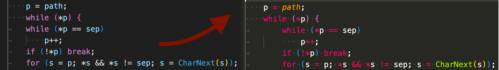

# Tabs are Two Indents

A tab character means two indentation levels in some codebases;
have Visual Studio Codde render it as such.



## Why?

As of June 2022, the notion of indentation size is coupled with tab width in
Visual Studio Code. Without any extensions, it's not possible to indent by 4
spaces but have tab characters render as wide as 8 spaces, for example.

There are many codebases where a tab character should render as two levels
of indentation. The following are some examples:

- [GCC](https://github.com/gcc-mirror/gcc/blob/113844d68e94f4e9c0e946db351ba7d3d4a1335a/libgfortran/intrinsics/c99_functions.c#L1890)
- [Ruby](https://github.com/ruby/ruby/blob/b1173ba6d34d5efbd2463424de8dae51b9ab7d73/ruby.c#L387)
- [Vim](https://github.com/vim/vim/blob/4e0fc8956649d3208aeaa1642c5efc44e385d77a/src/ui.c#L90)
- [Emacs](https://github.com/emacs-mirror/emacs/blob/b6238a26c97341cf2c34c12cf25c580f64d06a78/src/eval.c#L561)

There are [two][old] long-standing open features [requests][new] to separate
indentation size from tab size, but there is no native support in the editor as of yet.

## Limitations

Indent guides can be missing. While this extension makes the editor render
tab indents at the desired width, it does not teach Code that one tab is two levels
of indentation which require two levels of indent guides. You have the
option to disable the guides by setting the following:

```json
"editor.renderIndentGuides": false
```

Additionally, this extension does not change the width of tabs that are in the
middle of a line. The rendered width of a tab is fluid and depends on the
placement of the character within a tab stop. The editor itself is in the
best position to calculate the correct width.

There are additional extensions available to work around these issues, but
it would be better if Code could natively treat the tab size and indentation
size as separate.

Maybe leaving comments in the [feature][old] [requests][new] could make
the maintainers care more about this usecase?

## Configuration

Take a look at [package.json] to see available settings and commands.

[old]: https://github.com/microsoft/vscode/issues/5394
[new]: https://github.com/microsoft/vscode/issues/42740